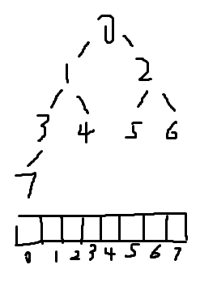

# 初级 2

## 快速排序

## 堆排序

- 满二叉树：每层节点从左向右补齐

- 用数组表示满二叉树

leftChild = root * 2 + 1

rightchild = root * 2  + 2

root = (child - 1) / 2

**堆是一个完全二叉树**

- 大根堆：子树的根节点都是子树的最大值
- 小根堆：子树的根节点都是子树的最小值

`heapInsert(int[] arr, int index)`：遍历数组把数组转换成一个大顶堆

`heapify(int[] arr, int index, int heapSize)`：根据heapSize把index的位置上的数放在合适的位置，O(logn)的复杂度

堆排序：把堆顶和堆尾的数字交换，然后把heapSize-1的堆顶元素下沉到合适位置