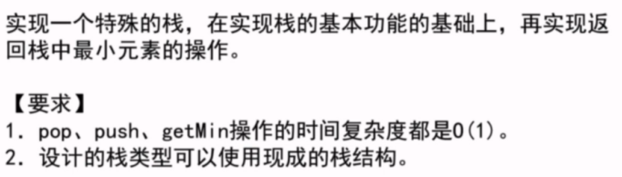

# 初级 3

## 排序算法的稳定性

## PriorityQueue

优先队列，本身数据结构是堆。

## 桶排序：基数排序、计数排序

基于非比较方式的排序。

[问题解答](../src/main/java/basic_class_01/maxGap/MaxGap.java)

## 队列和栈

队列：先进先出

[问题解答](../src/main/java/basic_class_01/stack/StackByArray.java)

栈：先进后出

[问题解答](../src/main/java/basic_class_01/queue/QueueByArray.java)

使用队列实现栈：

使用两个队列AB，添加数到A，返回数前将A的除最后一个数添加到B，返回A的最后一个，最后交换AB引用。

使用栈实现队列：

使用两个栈AB，添加数到A，出数之前，如果B为空，将A的所有数压进B，弹出B的第一个数。

