# 初级 4

## 猫狗游戏

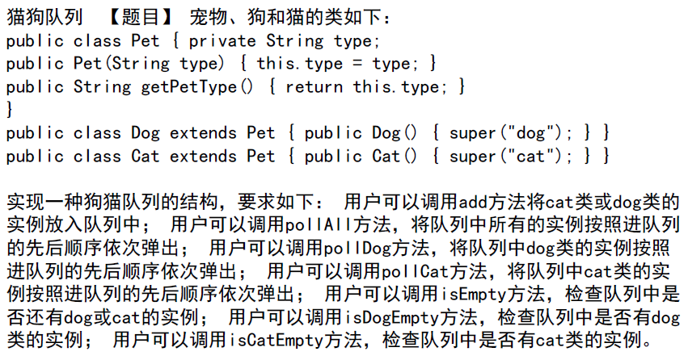

使用两个队列分别存储猫和狗，引入计数器记录猫狗进入队列的次序，根据次序和类型弹出元素。

## 矩阵操作

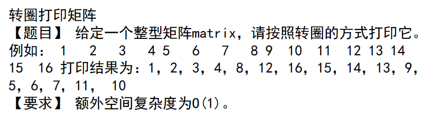

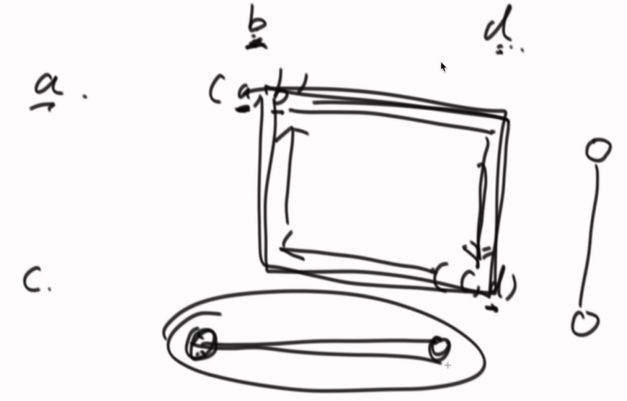

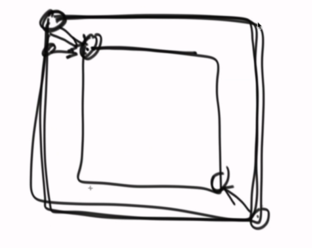

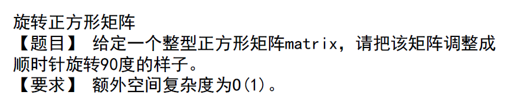

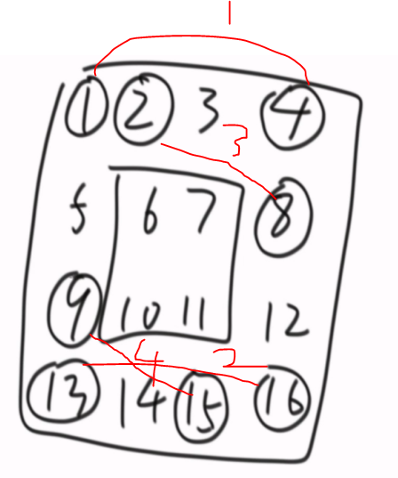

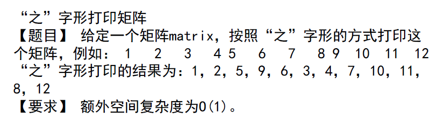

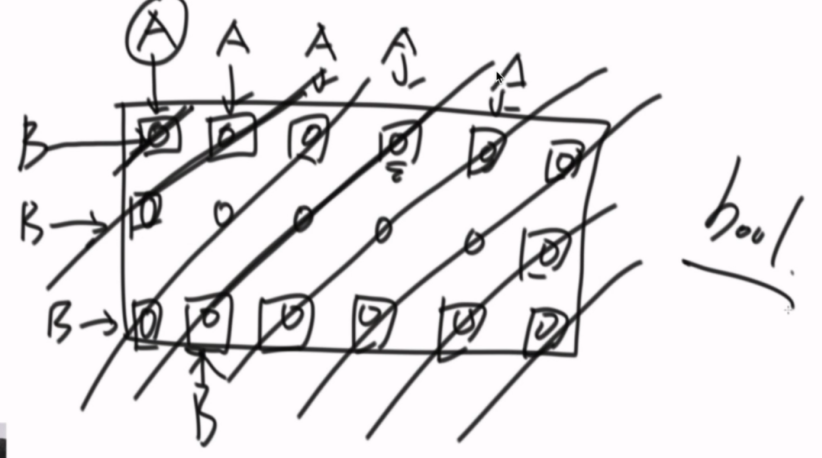

## 链表

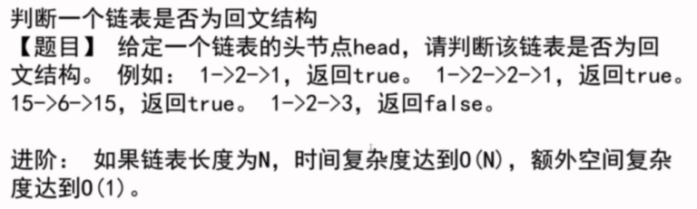

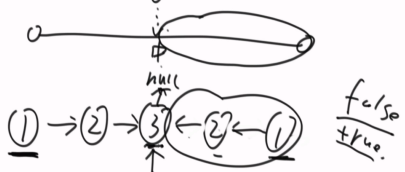

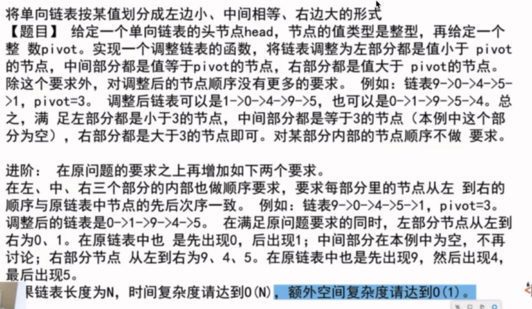

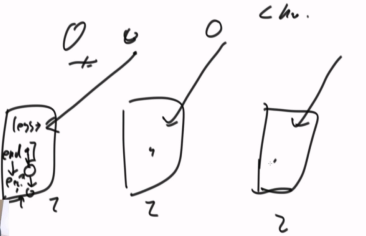

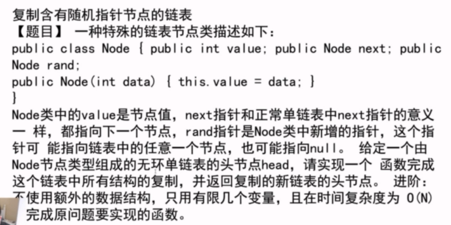

**通过HashMap存储原节点和复制节点，遍历两次分别复制和连接节点，最后返回复制节点。**

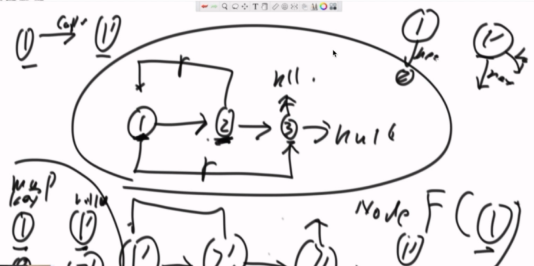

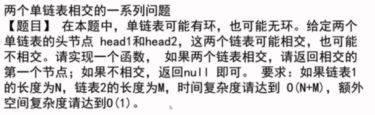

空间复杂度O(n)：hashMap存储节点，遍历并判断Map中是否有已经存在的节点判断环，第一个存在的节点为环的开始。

空间复杂度O(1)：快慢指针，快指针一次走2步，慢指针一次走1步，当二者相遇后，快指针回到头节点，二者每次走1步，快慢指针下次相遇的节点为环的开始。

交点判断：

- 两个都无环：map辅助（链表1放入map，遍历链表2判断）；遍历链表1和2的长度，根据长度判断相交的节点。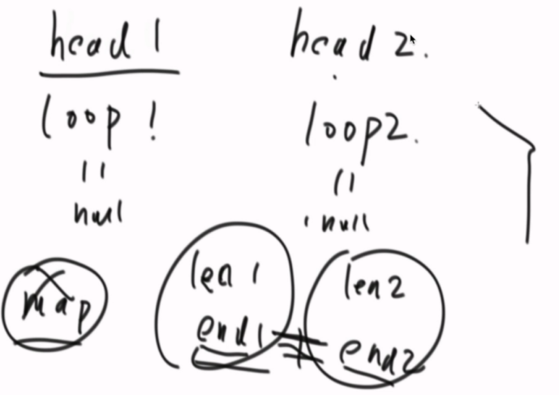

- 一个有环，一个没环：不相交
- 两个有环：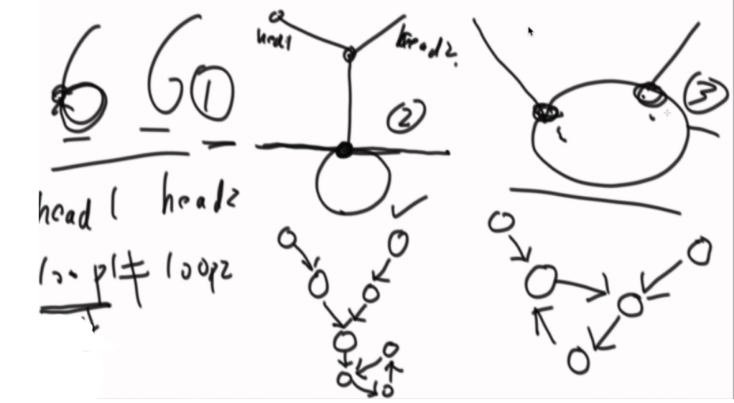

