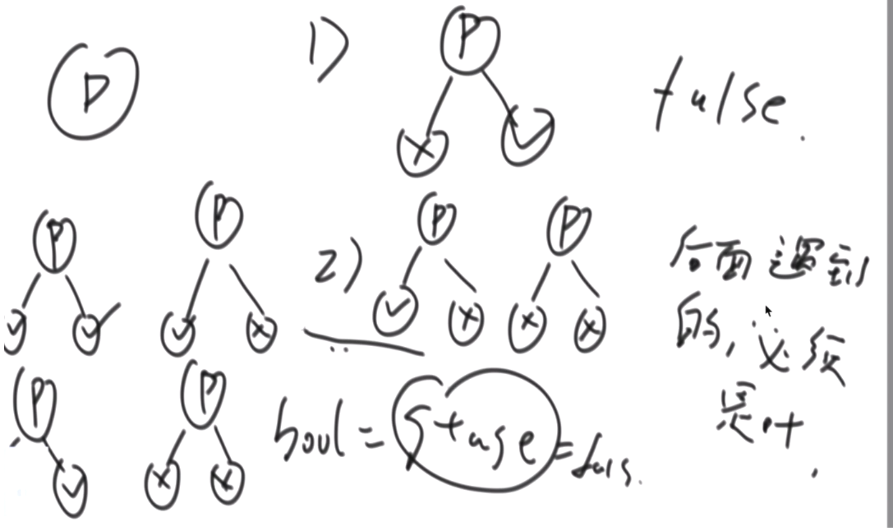

# 初级 5

## 二叉树遍历

### 先序遍历

递归方式：

```java
public void preOrder(TreeNode root) {
    if (root == null) {return;}
    System.out.println(root.val);
    preOrder(root.left);
    preOrder(root.right);
}
```

### 中序遍历

```java
public void preOrder(TreeNode root) {
    if (root == null) {return;}
    preOrder(root.left);
    System.out.println(root.val);
    preOrder(root.right);
}
```

### 后序遍历

```java
public void preOrder(TreeNode root) {
    if (root == null) {return;}
    preOrder(root.left);
    preOrder(root.right);
    System.out.println(root.val);
}
```
非递归方式：

[问题解答](../src/main/java/lessions/tree/TreeRecurve.java)

## 打印后继节点


### 规律：

- 若该节点存在右子树，则其后继节点为其**右子树最左边的节点**
- 若该节点不存在右子树，则想上寻找父节点，直到该父节点是某个节点的左节点，则该父节点的父节点为后继节点

[问题解答](../src/main/java/lessions/tree/TreeRecurve.java)

## 判断一颗二叉树是否是平衡二叉树

- 判断左子树是否平衡
- 判断右子树是否平衡

- 判断一个结点的左子树和右子树的高度差是否大于1

[问题解答]()

## 搜索二叉树

- 中序遍历结果升序
- 节点的左子节点比其小，右子节点比其大

## 完全二叉树

- 层序遍历
- 只有右子树没有左子树 return false
- 只有左子树或没有子树，之后的节点必须是叶子节点
- 

[问题解答]()